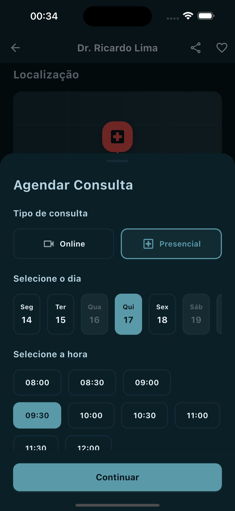
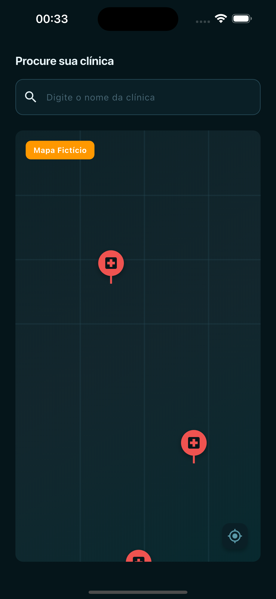
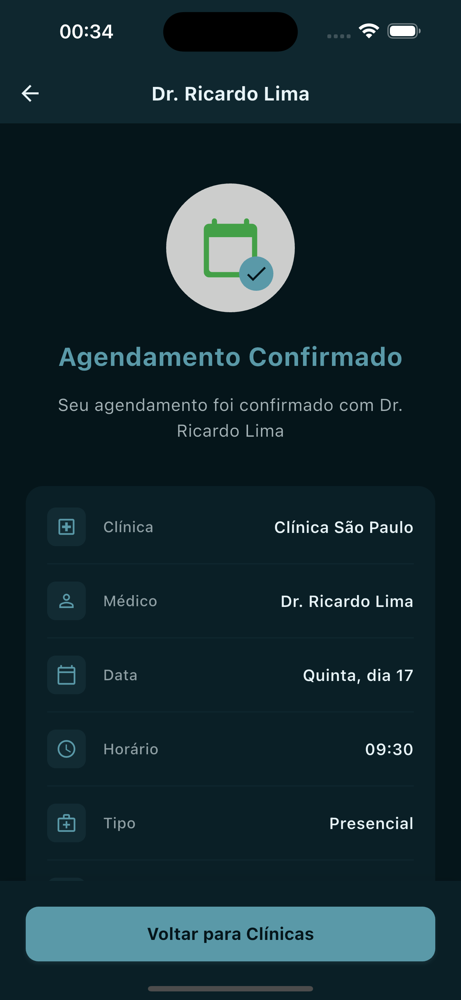
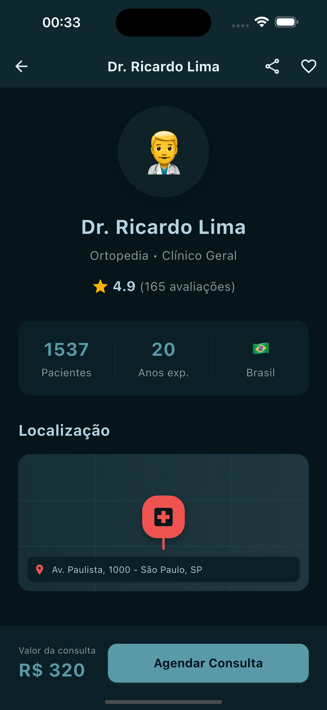
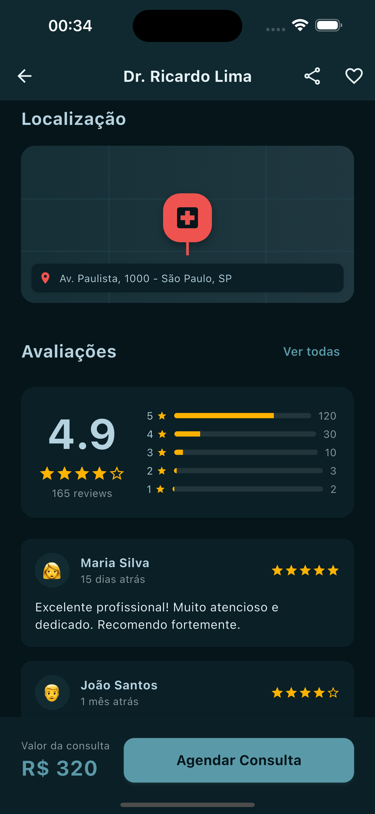

# PatientCare App 🏥

Aplicativo Flutter para gerenciamento de consultas médicas e cuidados com pacientes. O app permite buscar clínicas, visualizar perfis de médicos, agendar consultas e muito mais!

## 📱 Screenshots (Dark Mode)

<div align="center">

### 🔐 Login & Busca
<p>
  
  &nbsp;&nbsp;&nbsp;
  
</p>

### 👨‍⚕️ Médicos
<p>
  
  &nbsp;&nbsp;&nbsp;
  
</p>

### 📅 Agendamento
<p>
  
  &nbsp;&nbsp;&nbsp;
  
</p>

</div>

---

## ✨ Funcionalidades

### 🔐 Autenticação
- **Tela de Login**: Interface moderna com validação de formulário
- **Alternância de Tema**: Botão para alternar entre light e dark mode

### 🏥 Busca de Clínicas
- **Mapa Fictício**: Visualização interativa com marcadores de clínicas
- **Lista de Clínicas**: Cards com informações de distância e localização
- **Detalhes da Clínica**: Bottom sheet com endereço e botão de agendamento

### 👨‍⚕️ Médicos
- **Banner Informativo**: Destaque visual com chamada para ação
- **Filtro por Especialidade**: 8+ especialidades médicas (Cardiologia, Dermatologia, Pediatria, etc.)
- **Busca por Nome**: Campo de busca dinâmico
- **Lista de Médicos**: Cards com foto, nome, especialidade, experiência, avaliação e preço
- **Scroll Otimizado**: Lista rolável independente mantendo filtros fixos

### 📋 Perfil do Médico
- **Informações Completas**: Nome, especialidades, avaliação e foto
- **Estatísticas**: Número de pacientes, anos de experiência e país
- **Localização**: Mapa fictício com endereço
- **Avaliações**: Sistema de reviews com barras de progresso e comentários
- **Valor da Consulta**: Exibido no rodapé fixo

### 📅 Agendamento de Consulta
- **Bottom Sheet em 2 Páginas**: Navegação fluida entre etapas
- **Página 1**:
  - Tipo de consulta (Online/Presencial)
  - Seletor de dia (scroll horizontal com dias desabilitados)
  - Seletor de horário (8h às 12h)
- **Página 2**:
  - Resumo do agendamento
  - Prioridade (Normal/Urgência)
  - Método de pagamento (Dinheiro/Cartão de crédito)
- **Validação**: Desabilita botão "Continuar" se campos não preenchidos

### ✅ Confirmação
- **Tela de Sucesso**: Feedback visual com ícone de confirmação
- **Detalhes do Agendamento**: Todas as informações selecionadas
- **Navegação**: Botão para retornar à busca de clínicas

### 🎨 Design System
- **Paleta de Cores Personalizada**: 6 cores principais com variações para light/dark mode
- **Tema Adaptativo**: Suporte completo a light e dark mode
- **Material Design 3**: Componentes modernos e consistentes
- **Animações**: Transições suaves entre temas
- **Responsividade**: Adaptado para diferentes tamanhos de tela

## 🚀 Estrutura do Projeto

```
lib/
├── main.dart                           # Ponto de entrada da aplicação
├── routes/
│   └── app_router.dart                # Configuração de rotas com GoRouter
├── screens/
│   ├── login_screen.dart              # Tela de login
│   ├── search_clinics_screen.dart     # Busca de clínicas com mapa
│   ├── doctors_list_screen.dart       # Lista de médicos com filtros
│   ├── doctor_profile_screen.dart     # Perfil detalhado do médico
│   └── appointment_confirmation_screen.dart # Confirmação do agendamento
└── theme/
    ├── app_colors.dart                # Paleta de cores personalizada
    ├── app_theme.dart                 # Configuração dos temas light/dark
    ├── theme_provider.dart            # Gerenciamento de estado do tema
    └── README.md                      # Documentação do sistema de temas
```

## 📦 Dependências Principais

```yaml
dependencies:
  flutter:
    sdk: flutter
  cupertino_icons: ^1.0.8
  go_router: ^14.6.2          # Gerenciamento de rotas
  provider: ^6.1.2            # Gerenciamento de estado (tema)
```

## 🎨 Paleta de Cores

O app utiliza uma paleta customizada com as seguintes cores principais:

| Cor | Hex | Uso |
|-----|-----|-----|
| Primary Dark | `#05151A` | Backgrounds escuros |
| Primary Teal | `#3F7884` | **Cor principal do app** |
| Primary Teal Dark | `#0C7076` | Acentos e destaques |
| Primary Blue | `#0706FC` | Ações secundárias |
| Primary Cyan | `#6DA6C0` | Complementar |
| Primary Navy | `#294D61` | Textos e elementos |

Cada cor possui variações para light e dark mode, garantindo contraste e legibilidade em ambos os temas.

## 🏃 Como Executar

### Pré-requisitos

- Flutter SDK 3.6.1 ou superior
- Dart 3.0.0 ou superior
- Android Studio / Xcode (para desenvolvimento mobile)

### Instalação

```bash
# Clone o repositório
git clone [url-do-repositorio]

# Entre na pasta do projeto
cd patientcareapp

# Instalar dependências
flutter pub get

# Executar no emulador/dispositivo
flutter run
```

### Build para produção

```bash
# Android (APK)
flutter build apk --release

# Android (App Bundle)
flutter build appbundle --release

# iOS
flutter build ios --release
```

## 🛠️ Tecnologias e Conceitos Utilizados

- **Flutter**: Framework multiplataforma
- **Dart**: Linguagem de programação
- **Material Design 3**: Sistema de design
- **GoRouter**: Navegação declarativa com rotas nomeadas
- **Provider**: Gerenciamento de estado para alternância de tema
- **Custom Themes**: Sistema de cores e temas personalizados
- **Responsive Design**: Layout adaptável
- **Bottom Sheets**: Modais deslizantes com `DraggableScrollableSheet`
- **Formulários**: Validação e controle de inputs
- **ListView.builder**: Listas otimizadas com scroll
- **Gradient**: Degradês personalizados
- **BoxShadow**: Sombras e elevação de componentes

## 📂 Estrutura de Assets

O projeto inclui screenshots da aplicação em dark mode, localizados em:

```
assets/
└── screenshots/
    ├── login_dark.png
    ├── clinics_dark.png
    ├── doctors_dark.png
    ├── profile_dark.png
    ├── schedule_dark.png
    └── confirmation_dark.png
```

Para adicionar mais screenshots ou atualizar os existentes, salve as imagens na pasta `assets/screenshots/` com os nomes apropriados.

## 📝 Dados Fictícios

O app utiliza dados fictícios para fins de demonstração:

- **3 Clínicas**: Com endereços e distâncias simuladas
- **80 Médicos**: 10 médicos para cada uma das 8 especialidades
- **Avaliações**: Reviews fictícios com notas de 1 a 5 estrelas
- **Horários**: Disponibilidade de 8h às 12h
- **Dias**: Semana completa com alguns dias indisponíveis

## 🎯 Próximos Passos

- [ ] Integração com API real
- [ ] Autenticação com Firebase
- [ ] Integração com Google Maps real
- [ ] Sistema de notificações
- [ ] Histórico de consultas
- [ ] Perfil do usuário
- [ ] Sistema de favoritos
- [ ] Chat com médicos
- [ ] Pagamento online
- [ ] Prescrições digitais

## 📄 Licença

Este projeto é um estudo de caso para fins educacionais.

## 👨‍💻 Desenvolvido com

Desenvolvido com ❤️ usando Flutter

---

**PatientCare** - Cuidando da sua saúde com excelência e carinho 🏥✨
